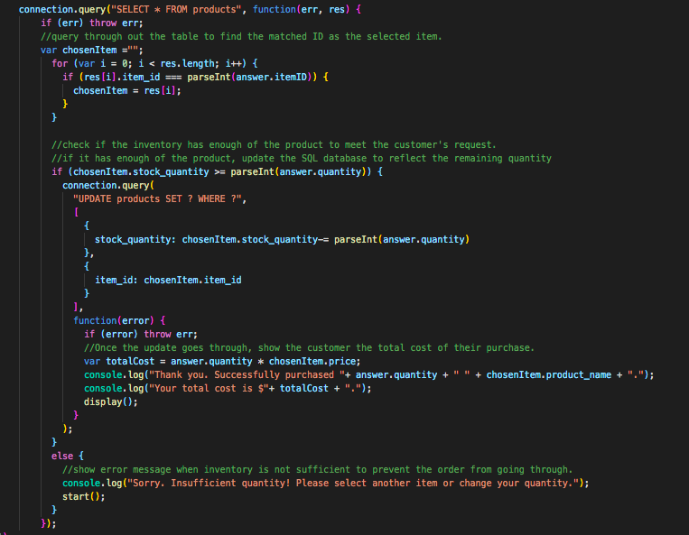

# Bamazon-Customer
Assignment_Bamazon-Customer

# Link to deployed site
https://lalatw.github.io/Bamazon-Customer/


# Images
 


# Technology used
* MySQL
* javascript
* node.js
* Inquirer


# Instruction and npm Install
* You'll need to run the program in Terminal/Bash using command-line.
* Please run npm Install for package needed as listed below.
* Populate database first by running bamazon.sql in MySQL Workbench or other available tools.
* Run "bamazonCustomer.js" in Terminal/Bash to start the program.

```
  "dependencies": {
    "cli-table": "^0.3.1",
    "inquirer": "^6.2.0",
    "mysql": "^2.16.0"
  }
```

# Code snippets

 


# Learning points
* Use MySQL to store data and query database.
* Create database and read data in need. 
* Apply Node.js to run backend and executes JavaScript code outside of a browser. 
* Run npm install to use pre-built packages of modules.
* Use Require to grab data from sources.


# Author 
[Shuhan Laura Lee](https://lalatw.github.io/Bamazon-Customer/)


# License
Standard MIT License